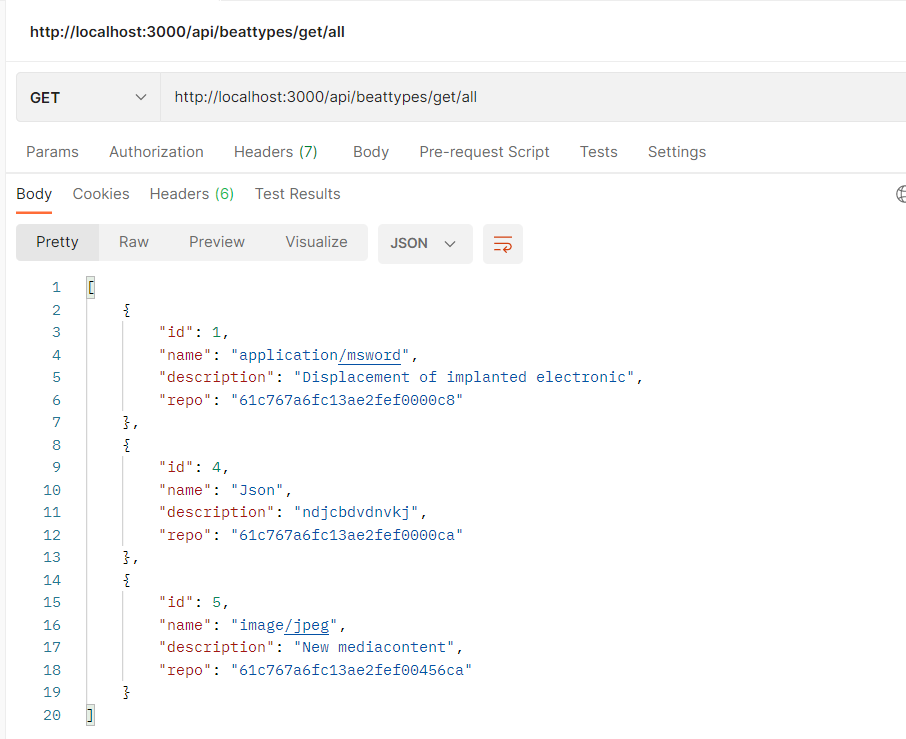
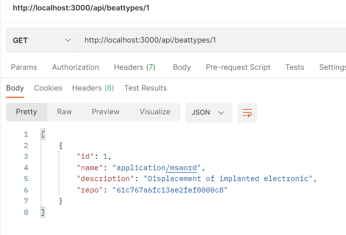
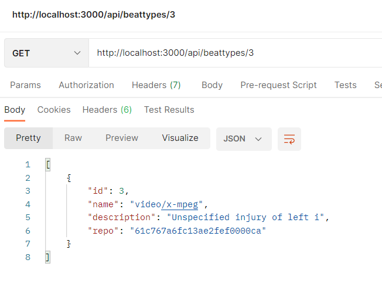
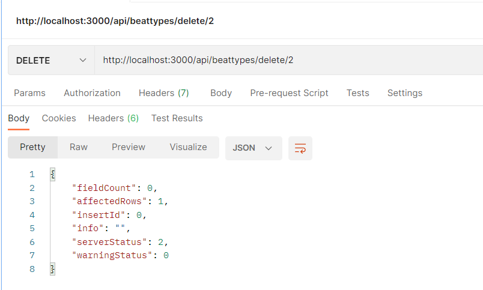
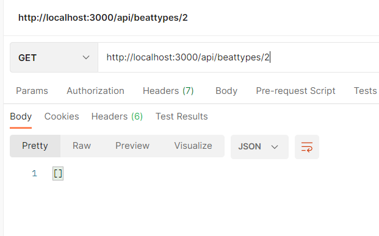
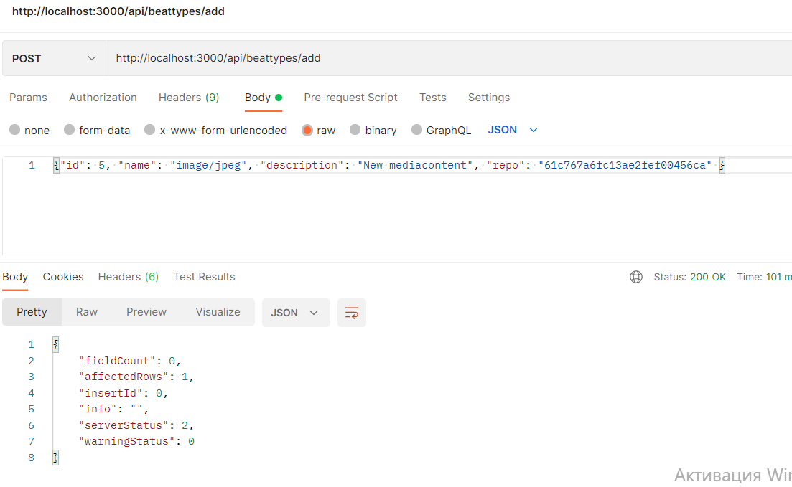
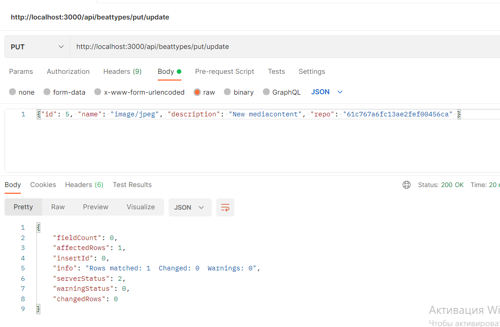

# Тестування працездатності системи

- '/api/beattypes/get/all' - Отримати всі біти

- '/api/beattypes/:id' - Отримати біт

 

- '/api/beattypes/delete/:id' - Видалити біт

 

- '/api/beattypes/add' - Додати біт

- '/api/beattypes/put/update' - Оновити дані

